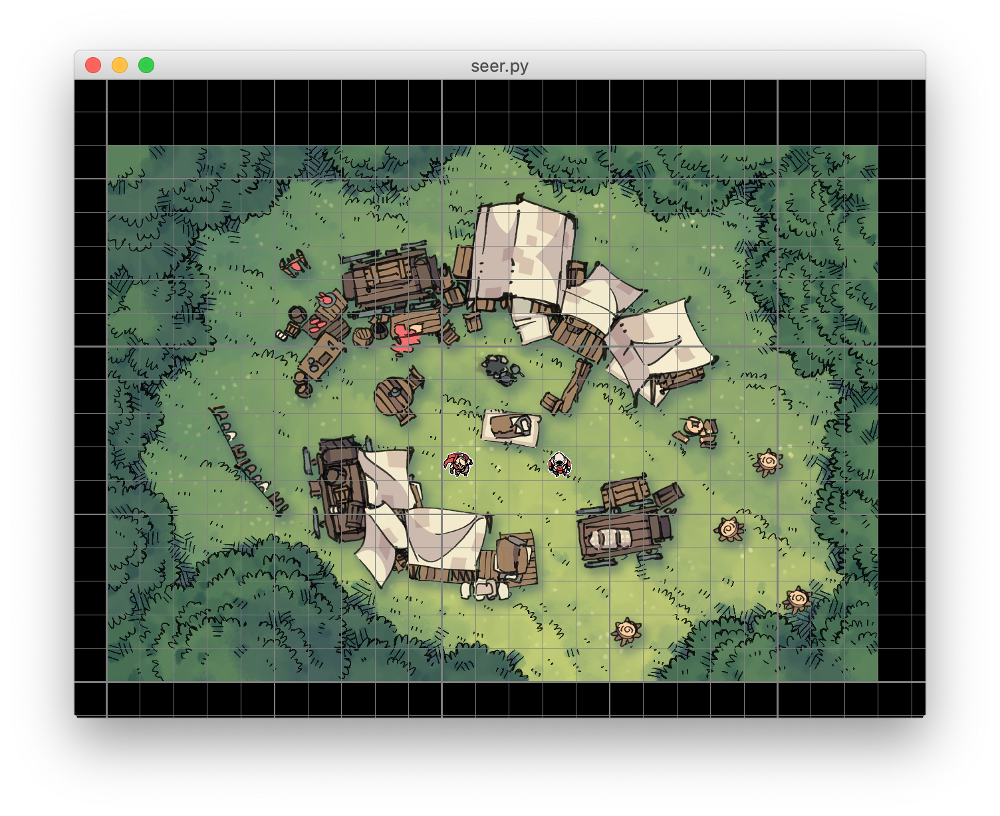

# Seer: tabletop RPG over internet

## Features and limitations

* The program shows a shared map, on which the dungeon master and the players
  can move tokens.
* One DM and any number of players.
* Serverless, DM's computer acts as a server.
* Requires IPv6 to avoid dealing with NAT.
* The campaign is specified by a JSON file. No editing functionality yet.
* Campaign can contain several maps ("pages").
* DM can hide/reveal some parts of the map to the players.

## Run

For GM:

    python3 seer.py <campaign directory>

See `campaign/` for an example of campaign directory. The campaign directory
should contain the file `data.json` the describes the maps and resources.

The GM's instance of the game prints the line:

    Address: <IPv6 address>

This address is used to run the player's instance of the game:

    python3 seer.py <master's address> <player's name>

## Requirements

Tested on Python 3.8, probably also works on Python 3.6-3.7. Tested on macOS,
but should also work on Windows and Linux. Requires requests and pyglet:

    pip install --upgrade requests pyglet

## Controls

| Key                | Operation                                          |
|--------------------|----------------------------------------------------|
| Esc                | Exit                                               |
| W, A, S, D         | Pan map                                            |
| Scroll wheel       | Zoom                                               |
| F                  | Toggle fullscreen                                  |
| G                  | Toggle grid                                        |
| Mouse drag         | Drag a token that you can control.                 |
| Shift + mouse drag | Align to grid after move.                          |
| PgUp, PgDn         | Turn to the previous/next page (DM only).          |
| P                  | Bring players to the current map (DM only).        |
| Cmd/Ctrl + click   | Cover/reveal a zone on the map (DM only).          |

## Roadmap

- [x] DM can change the page visible to the players.
- [x] Save the campaign state upon exiting.
- [x] Make it possible for DM to hide parts of the map from the players.
- [x] Distinguish between dragging a character and finishing its movement.
- [ ] Add chat.
- [ ] Make it possible to roll dice in the chat.
- [ ] UI for DM to add map tiles and tokens to the campaign.
- [ ] UI for DM to align map tiles.
- [ ] UI to add tokens to the game.
- [ ] Rudimentary character sheets.
- [ ] Make it possible to indicate a point on the map.
- [ ] Support IPv4

## Acknowledgements

The assets in the example campaign are from
[2minutetabletop.com](https://2minutetabletop.com/), and are used in accordance
with [CC BY-NC 4.0](https://creativecommons.org/licenses/by-nc/4.0/).
